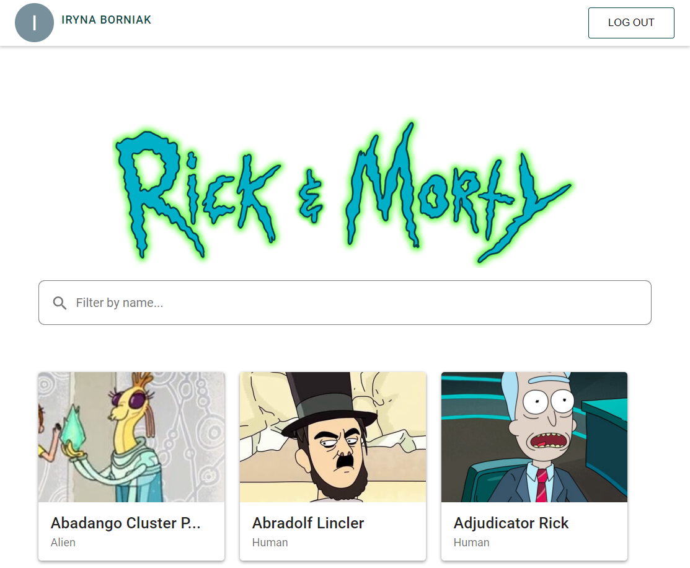
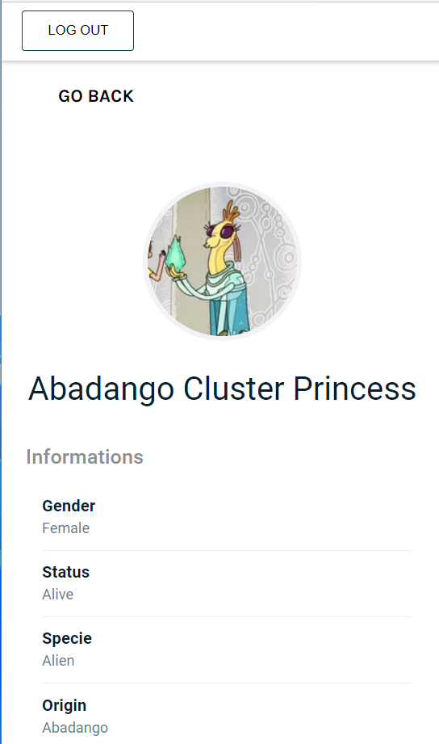

# Rick And Morty

[DEMO LINK](https://rick-and-morty-ba996.web.app/) 

## Technologies

<ul>
    <li>React</li>
    <li>TypeScript</li> 
    <li>SASS</li>
    <li>Firebase</li>       
</ul>

## Installation
```bash
$ npm install
```
## Running the App
```bash
$ npm run start
```
## App Screenshots
Main page:



Character page:

